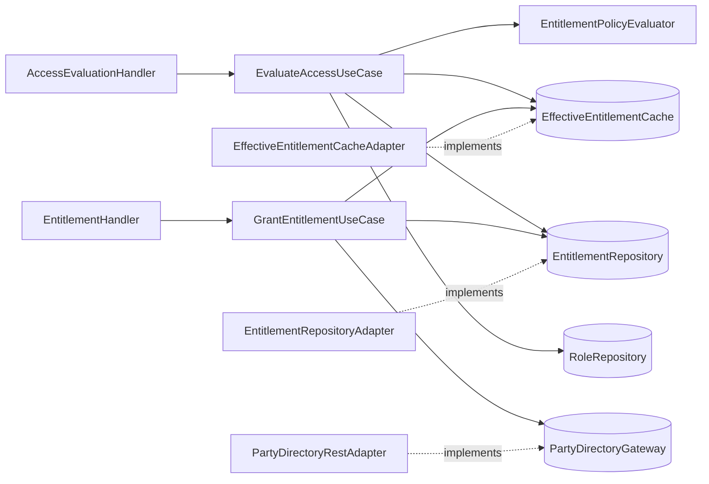
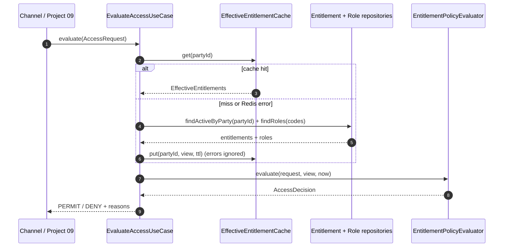
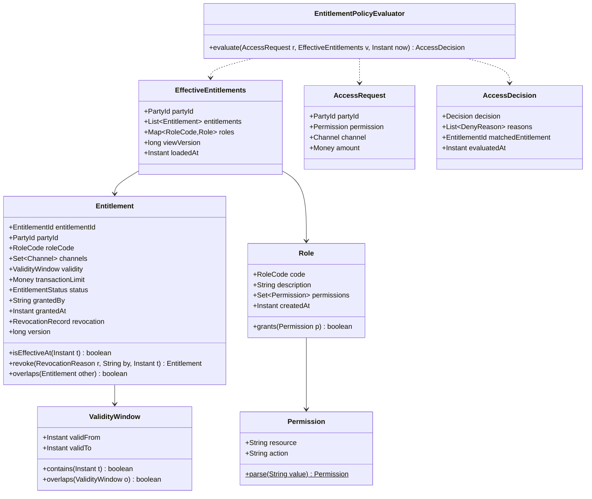
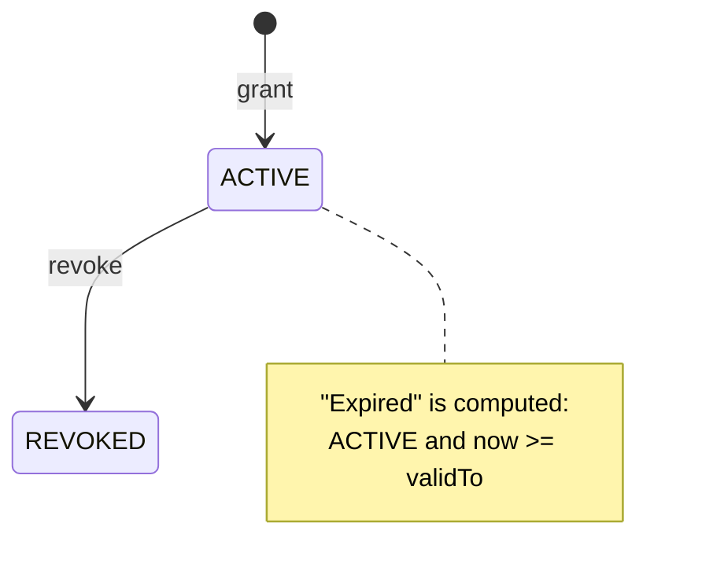

# Customer Access Entitlement Service

> **Level:** Junior (3 of 3) · **BIAN Service Domain:** Customer Access Entitlement · **Repository:** `access-entitlement` · **Base package:** `co.com.dmillan.entitlement`
> **Stack:** Java 25 · Spring WebFlux (functional routes) · R2DBC PostgreSQL · Redis (reactive) · WebClient · Spring Security Resource Server

---

## 1. Project Overview

| Attribute | Value |
|---|---|
| Technical name | `access-entitlement` |
| BIAN Service Domain | Customer Access Entitlement |
| BIAN control record (as modelled here) | Customer Access Entitlement Arrangement |
| BIAN action terms used | Register (role), Grant, Terminate (revoke), Evaluate, Retrieve |
| Difficulty | Junior (capstone of the junior tier) |
| Paradigm | Reactive |
| Stores | PostgreSQL (source of truth), Redis (effective-entitlement cache) |
| Depends on | Project 02 (party must exist and be operable) |
| Suggested timebox | 2 weeks part-time |

**Elevator pitch.** Authentication tells you *who* a customer is; entitlement tells you *what they may do*, *on which channel*, and *up to what amount*. This service maintains a role catalog, grants roles to parties per channel with validity windows and transaction limits, and answers a high-volume question — "may party X perform `transfers:execute` on `APP` for 2,000,000 COP right now?" — with a PERMIT/DENY decision and explicit reasons. Decisions must be fast (Redis cache-aside) and **fail closed**.

**What you will build**

- Role catalog: register roles with permissions (`resource:action`).
- Grant and revoke entitlements for a party.
- Evaluate an access request against effective entitlements (pure domain policy).
- Cache effective entitlements per party in Redis with explicit invalidation.
- Call project 02 through a WebClient adapter with timeouts.

**Out of scope**

- Delegation (acting on behalf of another party), ABAC with arbitrary attributes (project 10 touches ABAC), admin UI.

---

## 2. Business Context and Functional Scope

### 2.1 Business problem

Digital channels hard-code rules such as "app users can transfer up to X". When risk or product teams change a limit, several channel releases are needed, and rules drift between channels. Centralizing entitlements gives one place to change them and one auditable decision log.

### 2.2 Actors

| Actor | Scope |
|---|---|
| Product/back-office admin service | `entitlement:admin` (roles, grants, revokes) |
| Channel backends and project 09 | `entitlement:evaluate` |
| Support workbench | `entitlement:read` |
| Project 08 (containment) | `entitlement:admin` (revoke on fraud) |

### 2.3 Functional requirements

| Id | Requirement |
|---|---|
| FR-01 | Register a role with a code (`RETAIL_BASIC`, `RETAIL_PLUS`, …), description, and a set of permissions. Role codes are unique and immutable. |
| FR-02 | Grant a role to a party with: channels (set), `validFrom`, optional `validTo`, optional per-transaction limit (Money), granted-by. |
| FR-03 | Granting requires the party to exist and be operable in project 02. |
| FR-04 | Revoke an entitlement with a reason; revoked entitlements are kept for audit. |
| FR-05 | List a party's entitlements (active, revoked, expired). |
| FR-06 | Evaluate an access request `(partyId, permission, channel, amount?)` → `PERMIT` or `DENY` + reasons + matched entitlement id. |
| FR-07 | Evaluation reads effective entitlements from Redis; on miss, loads from PostgreSQL and populates the cache. |
| FR-08 | Grant/revoke invalidates the party's cache entry **after** the database commit. |

### 2.4 Business rules

| Id | Rule |
|---|---|
| BR-01 | Permission format: `^[a-z][a-z-]{1,30}:[a-z][a-z-]{1,20}$` (e.g., `transfers:execute`). |
| BR-02 | An entitlement is effective at instant *t* when `status = ACTIVE` and `validFrom <= t` and (`validTo` is null or `t < validTo`). |
| BR-03 | A request is permitted when at least one effective entitlement: covers the channel, its role includes the permission, and (if the request has an amount) the entitlement has no limit or `amount <= limit` in the same currency. |
| BR-04 | Deny reasons (collect all that apply, in this order): `NO_ENTITLEMENTS`, `CHANNEL_NOT_ALLOWED`, `PERMISSION_NOT_GRANTED`, `LIMIT_EXCEEDED`, `CURRENCY_MISMATCH`. |
| BR-05 | A party cannot hold two ACTIVE entitlements for the same role with overlapping validity windows. |
| BR-06 | `validTo`, when present, must be after `validFrom`; maximum grant duration is 5 years. |
| BR-07 | If the entitlement store is unavailable, evaluation **fails closed**: HTTP 503, never PERMIT. |
| BR-08 | If only Redis is unavailable, evaluation falls back to PostgreSQL (degraded but correct). |

### 2.5 BIAN mapping

| Capability | BIAN action term | Endpoint |
|---|---|---|
| Register role | Register | `POST /api/v1/customer-access-entitlement/roles` |
| Retrieve roles | Retrieve | `GET /api/v1/customer-access-entitlement/roles` |
| Grant entitlement | Grant | `POST /api/v1/customer-access-entitlement/parties/{partyId}/entitlements` |
| Revoke entitlement | Terminate | `POST /api/v1/customer-access-entitlement/parties/{partyId}/entitlements/{entitlementId}/revocation` |
| List entitlements | Retrieve | `GET /api/v1/customer-access-entitlement/parties/{partyId}/entitlements` |
| Evaluate access | Evaluate | `POST /api/v1/customer-access-entitlement/access-evaluations` |

---

## 3. Architecture and Learning Objectives

### 3.1 Learning objectives

1. Implement a **pure policy** (`EntitlementPolicyEvaluator`) with zero I/O and exhaustive unit tests.
2. Implement **cache-aside** with reactive Redis and reason about staleness and invalidation order.
3. Call another microservice through a **port** (`PartyDirectoryGateway`) with WebClient, timeouts, and error mapping.
4. Use `Flux` operators to assemble a view from several sources (`collectList`, `collectMap`, `zipWith`).
5. Design **fail-closed** behavior and make it testable.
6. Use R2DBC transactions (`TransactionalOperator`) for multi-row consistency.

### 3.2 Layer map

| Layer | Module | Responsibilities |
|---|---|---|
| Domain | `domain/model` | `Role`, `Permission`, `Entitlement`, `EffectiveEntitlements`, `AccessRequest`, `AccessDecision`, `EntitlementPolicyEvaluator`, gateways |
| Domain (application logic) | `domain/usecase` | Register role, grant, revoke, list, evaluate |
| Application | `applications/app-service` | Wiring, clock, properties |
| Entry Points | `entry-points/reactive-web` | Routes, handlers, DTOs, errors, security |
| Driven Adapters | `driven-adapters/r2dbc-postgresql` | Roles, role permissions, entitlements |
| Driven Adapters | `driven-adapters/redis` | `EffectiveEntitlementCacheAdapter` |
| Driven Adapters | `driven-adapters/rest-consumer` | `PartyDirectoryRestAdapter` (calls project 02) |

### 3.3 Dependency direction



`EntitlementPolicyEvaluator` depends on nothing but domain types and receives `Instant now` as a parameter. It is the most valuable class in the repository; protect it with the most tests.

### 3.4 Scaffold commands

```shell
gradle ca --package=co.com.dmillan.entitlement --type=reactive --name=access-entitlement --lombok=true --metrics=true --mutation=true
gradle gm  --name=Role
gradle gm  --name=Entitlement
gradle guc --name=RegisterRole
gradle guc --name=RetrieveRoles
gradle guc --name=GrantEntitlement
gradle guc --name=RevokeEntitlement
gradle guc --name=RetrievePartyEntitlements
gradle guc --name=EvaluateAccess
gradle gda --type=r2dbc
gradle gda --type=redis --mode=template
gradle gda --type=restconsumer --url=http://localhost:8082
gradle gep --type=webflux --router=true
gradle validateStructure
```

### 3.5 Evaluation flow



### 3.6 Cache invalidation order

On grant/revoke: **commit to PostgreSQL first, then evict Redis.** If you evict first, a concurrent evaluation can repopulate the cache with the old data before your commit. Even with the right order, a small race remains (a reader loads old data, you commit and evict, the reader writes the old data to the cache). Mitigations to discuss: short TTL (the bound on staleness), a version stamp per party stored in the cached value and compared on read, or delete-after-delay ("double delete"). Implement the short TTL plus a `viewVersion` field; document the rest in an ADR.

### 3.7 Design decisions

| Decision | Choice | Why |
|---|---|---|
| Cache granularity | One key per party with the full effective view | Evaluation needs the whole view; one round trip |
| Cache format | JSON (Jackson) with a `schemaVersion` field | Human-readable; safe evolution |
| TTL | 10 minutes + random jitter up to 60 s | Bounded staleness; avoids stampedes |
| Fail mode | Closed for DB failure, open for cache failure (fallback to DB) | Correctness over availability for authorization |
| Party check | Synchronous REST call on grant only | Grants are rare; evaluation must not depend on project 02 |

---

## 4. Detailed Domain Model

### 4.1 Class diagram



### 4.2 Types

| Type | Kind | Notes |
|---|---|---|
| `RoleCode` | VO | `^[A-Z][A-Z0-9_]{2,39}$` |
| `Permission` | VO | BR-01; `toString()` = `resource:action` |
| `Role` | Entity | Immutable after creation in this version |
| `EntitlementId`, `PartyId` | VO | UUID |
| `Channel` | Enum | Same values as project 01 |
| `Money`, `CurrencyCode` | VO | Same rules as project 01 (copy, do not share a library yet — explain why in an ADR) |
| `ValidityWindow` | VO | BR-06 |
| `EntitlementStatus` | Enum | `ACTIVE`, `REVOKED` (EXPIRED is **derived** from the window, not stored — discuss) |
| `RevocationReason` | Enum | `CUSTOMER_REQUEST`, `FRAUD_CONTAINMENT`, `PRODUCT_CHANGE`, `ADMIN_CORRECTION` |
| `RevocationRecord` | VO | `reason`, `revokedBy`, `revokedAt` |
| `Decision` | Enum | `PERMIT`, `DENY` |
| `DenyReason` | Enum | BR-04 values |
| `GrantEntitlementCommand` | Command | `partyId`, `roleCode`, `channels`, `validFrom`, `validTo`, `limit`, `grantedBy` |
| `RevokeEntitlementCommand` | Command | `partyId`, `entitlementId`, `reason`, `revokedBy` |
| `PartyStatusView` | VO | `partyId`, `boolean operable` — what the gateway returns (anti-corruption: we do not import project 02's model) |

### 4.3 Entitlement lifecycle



### 4.4 Policy algorithm (write it yourself from this description)

1. Keep entitlements where `isEffectiveAt(now)`. If none → DENY `[NO_ENTITLEMENTS]`.
2. Filter by channel. If none → DENY `[CHANNEL_NOT_ALLOWED]`.
3. Filter by role granting the permission (role must exist in the view map; a missing role is treated as granting nothing). If none → DENY `[PERMISSION_NOT_GRANTED]`.
4. If the request has no amount → PERMIT with the first match (deterministic order: `grantedAt` ascending, then id).
5. Otherwise, among matches: any with no limit → PERMIT; any with same currency and `amount <= limit` → PERMIT; else DENY with `LIMIT_EXCEEDED` if a same-currency limit exists and/or `CURRENCY_MISMATCH` if only other currencies exist.

---

## 5. Detailed Class and Package Specification

### 5.1 Package tree

```text
access-entitlement/
├── applications/app-service/src/main/java/co/com/dmillan/entitlement/
│   ├── MainApplication.java
│   └── config/{UseCasesConfig, DomainServicesConfig, ClockConfig, EntitlementProperties}.java
├── domain/model/src/main/java/co/com/dmillan/entitlement/model/
│   ├── role/{Role, RoleCode, Permission}.java
│   ├── role/gateways/RoleRepository.java
│   ├── entitlement/{Entitlement, EntitlementId, EntitlementStatus, ValidityWindow, RevocationReason, RevocationRecord, EffectiveEntitlements}.java
│   ├── entitlement/command/{GrantEntitlementCommand, RevokeEntitlementCommand}.java
│   ├── entitlement/gateways/{EntitlementRepository, EffectiveEntitlementCache}.java
│   ├── access/{AccessRequest, AccessDecision, Decision, DenyReason}.java
│   ├── access/service/EntitlementPolicyEvaluator.java
│   ├── party/{PartyId, PartyStatusView}.java
│   ├── party/gateways/PartyDirectoryGateway.java
│   └── commons/{Channel, Money, CurrencyCode}.java, commons/gateways/IdGenerator.java, commons/exception/*.java
├── domain/usecase/src/main/java/co/com/dmillan/entitlement/usecase/
│   ├── registerrole/RegisterRoleUseCase.java
│   ├── retrieveroles/RetrieveRolesUseCase.java
│   ├── grantentitlement/GrantEntitlementUseCase.java
│   ├── revokeentitlement/RevokeEntitlementUseCase.java
│   ├── retrievepartyentitlements/RetrievePartyEntitlementsUseCase.java
│   └── evaluateaccess/{EvaluateAccessUseCase, EffectiveEntitlementsLoader}.java
├── infrastructure/entry-points/reactive-web/src/main/java/co/com/dmillan/entitlement/api/
│   ├── RouterRest.java
│   ├── RoleHandler.java  EntitlementHandler.java  AccessEvaluationHandler.java
│   ├── dto/{RegisterRoleRequest, RoleResponse, GrantEntitlementRequest, RevokeEntitlementRequest, EntitlementResponse, AccessEvaluationRequest, AccessEvaluationResponse, MoneyDto}.java
│   ├── mapper/{RoleDtoMapper, EntitlementDtoMapper, AccessDtoMapper}.java
│   ├── support/{HeaderExtractor, RequestValidator}.java
│   ├── config/SecurityConfig.java
│   └── error/{GlobalErrorHandler, ErrorHttpStatusMapper}.java
├── infrastructure/driven-adapters/r2dbc-postgresql/src/main/java/co/com/dmillan/entitlement/r2dbc/
│   ├── role/{RoleEntity, RolePermissionEntity, RoleDataRepository, RolePermissionDataRepository, RoleRepositoryAdapter}.java
│   └── entitlement/{EntitlementEntity, EntitlementChannelEntity, EntitlementDataRepository, EntitlementChannelDataRepository, EntitlementRepositoryAdapter, EntitlementEntityMapper}.java
├── infrastructure/driven-adapters/redis/src/main/java/co/com/dmillan/entitlement/redis/
│   ├── EffectiveEntitlementCacheAdapter.java
│   ├── CachedEntitlementView.java
│   ├── CachedEntitlementViewMapper.java
│   └── config/RedisCacheConfig.java
└── infrastructure/driven-adapters/rest-consumer/src/main/java/co/com/dmillan/entitlement/consumer/
    ├── PartyDirectoryRestAdapter.java
    ├── PartyDirectoryResponse.java
    └── config/{PartyDirectoryClientConfig, PartyDirectoryProperties}.java
```

### 5.2 Domain — signatures

```java
public record Permission(String resource, String action) {
  public static Permission parse(String value);        // BR-01
  @Override public String toString();
}

public record Role(RoleCode code, String description, Set<Permission> permissions, Instant createdAt) {
  public Role { /* copy to unmodifiable set; non-empty */ }
  public boolean grants(Permission permission);
}

public record ValidityWindow(Instant validFrom, Instant validTo) {
  public ValidityWindow { /* BR-06 */ }
  public boolean contains(Instant instant);
  public boolean overlaps(ValidityWindow other);
}

@Builder(toBuilder = true)
public record Entitlement(EntitlementId entitlementId, PartyId partyId, RoleCode roleCode,
    Set<Channel> channels, ValidityWindow validity, Money transactionLimit,
    EntitlementStatus status, String grantedBy, Instant grantedAt,
    RevocationRecord revocation, long version) {
  public static Entitlement grant(EntitlementId id, GrantEntitlementCommand command, Instant now);
  public boolean isEffectiveAt(Instant instant);
  public boolean allowsChannel(Channel channel);
  public boolean overlaps(Entitlement other);          // same role + ACTIVE + windows overlap
  public Entitlement revoke(RevocationReason reason, String revokedBy, Instant now);  // already revoked → BusinessException
}

public record EffectiveEntitlements(PartyId partyId, List<Entitlement> entitlements,
                                    Map<RoleCode, Role> roles, long viewVersion, Instant loadedAt) {
  public static EffectiveEntitlements empty(PartyId partyId, Instant now);
}

public record AccessRequest(PartyId partyId, Permission permission, Channel channel, Money amount) {}

public record AccessDecision(Decision decision, List<DenyReason> reasons,
                             EntitlementId matchedEntitlement, Instant evaluatedAt) {
  public static AccessDecision permit(EntitlementId matched, Instant at);
  public static AccessDecision deny(List<DenyReason> reasons, Instant at);
  public boolean permitted();
}

public final class EntitlementPolicyEvaluator {
  public AccessDecision evaluate(AccessRequest request, EffectiveEntitlements view, Instant now);
}
```

### 5.3 Gateways — signatures

```java
public interface RoleRepository {
  Mono<Role> save(Role role);                                   // duplicate code → DuplicateRoleException
  Mono<Role> findByCode(RoleCode code);
  Flux<Role> findAll();
  Flux<Role> findByCodes(Collection<RoleCode> codes);
}

public interface EntitlementRepository {
  Mono<Entitlement> create(Entitlement entitlement);
  Mono<Entitlement> update(Entitlement entitlement);            // optimistic lock
  Mono<Entitlement> findById(EntitlementId id);
  Flux<Entitlement> findByParty(PartyId partyId);
  Flux<Entitlement> findActiveByParty(PartyId partyId);
  Mono<Long> currentViewVersion(PartyId partyId);               // max(version) or a per-party counter
}

public interface EffectiveEntitlementCache {
  Mono<EffectiveEntitlements> get(PartyId partyId);             // empty on miss; error on Redis failure
  Mono<Void> put(EffectiveEntitlements view);
  Mono<Void> evict(PartyId partyId);
}

public interface PartyDirectoryGateway {
  Mono<PartyStatusView> findStatus(PartyId partyId);            // empty when 404
}
```

### 5.4 Use cases — signatures and steps

```java
public class RegisterRoleUseCase { public Mono<Role> register(RoleCode code, String description, Set<Permission> permissions); }
public class RetrieveRolesUseCase { public Flux<Role> retrieveAll(); }

public class GrantEntitlementUseCase {
  public GrantEntitlementUseCase(EntitlementRepository entitlements, RoleRepository roles,
      PartyDirectoryGateway partyDirectory, EffectiveEntitlementCache cache, IdGenerator ids, Clock clock);
  public Mono<Entitlement> grant(GrantEntitlementCommand command);
}
```
Steps: role exists (`ENT-4042`) → party status (`ENT-4041` when empty, `ENT-4221` when not operable) → load active entitlements for party → reject overlap (`ENT-4091`) → `Entitlement.grant` → `create` → `then(cache.evict(...).onErrorResume(log-and-continue))` → return entitlement. Run the role and party checks in parallel with `Mono.zip`.

```java
public class RevokeEntitlementUseCase {
  public Mono<Entitlement> revoke(RevokeEntitlementCommand command);   // load → party matches (ENT-4043) → revoke → update → evict
}

public class RetrievePartyEntitlementsUseCase {
  public Flux<Entitlement> retrieve(PartyId partyId);
}

public class EffectiveEntitlementsLoader {                              // helper inside usecase module (not a *UseCase → register with @Bean)
  public EffectiveEntitlementsLoader(EntitlementRepository e, RoleRepository r, Clock clock);
  public Mono<EffectiveEntitlements> loadFromStore(PartyId partyId);    // findActiveByParty → collect → roles by codes → collectMap
}

public class EvaluateAccessUseCase {
  public EvaluateAccessUseCase(EffectiveEntitlementCache cache, EffectiveEntitlementsLoader loader,
                               EntitlementPolicyEvaluator evaluator, Clock clock);
  public Mono<AccessDecision> evaluate(AccessRequest request);
}
```
Steps: `cache.get` → `onErrorResume` (log, metric `cache_error`) → `Mono.empty()` → `switchIfEmpty(loader.loadFromStore(...).flatMap(view -> cache.put(view).onErrorResume(...).thenReturn(view)))` → `evaluator.evaluate(request, view, clock.instant())`. Store errors propagate as `TechnicalException(ENT-5001)` → 503 (fail closed).

### 5.5 Entry point — signatures

```java
@Configuration
public class RouterRest {
  @Bean
  public RouterFunction<ServerResponse> entitlementRoutes(RoleHandler roles, EntitlementHandler entitlements,
                                                          AccessEvaluationHandler evaluations);
}

@Component public class RoleHandler {
  public Mono<ServerResponse> register(ServerRequest request);
  public Mono<ServerResponse> retrieveAll(ServerRequest request);
}
@Component public class EntitlementHandler {
  public Mono<ServerResponse> grant(ServerRequest request);
  public Mono<ServerResponse> revoke(ServerRequest request);
  public Mono<ServerResponse> retrieveByParty(ServerRequest request);
}
@Component public class AccessEvaluationHandler {
  public Mono<ServerResponse> evaluate(ServerRequest request);
}
```

Authorization with functional routes: configure path + method rules in `SecurityConfig` (`pathMatchers(HttpMethod.POST, "/api/v1/customer-access-entitlement/access-evaluations").hasAuthority("SCOPE_entitlement:evaluate")`, etc.).

DTOs:

```java
public record RegisterRoleRequest(
  @NotBlank @Pattern(regexp = "^[A-Z][A-Z0-9_]{2,39}$") String code,
  @NotBlank @Size(max = 200) String description,
  @NotEmpty @Size(max = 50) Set<@Pattern(regexp = "^[a-z][a-z-]{1,30}:[a-z][a-z-]{1,20}$") String> permissions) {}

public record GrantEntitlementRequest(
  @NotBlank String roleCode,
  @NotEmpty Set<Channel> channels,
  @NotNull Instant validFrom,
  Instant validTo,
  @Valid MoneyDto transactionLimit,
  @NotBlank @Size(max = 64) String grantedBy) {}

public record RevokeEntitlementRequest(@NotNull RevocationReason reason, @NotBlank @Size(max = 64) String revokedBy) {}

public record AccessEvaluationRequest(
  @NotNull UUID partyId,
  @NotBlank String permission,
  @NotNull Channel channel,
  @Valid MoneyDto amount) {}

public record AccessEvaluationResponse(String decision, List<String> reasons,
                                       String matchedEntitlementId, Instant evaluatedAt) {}

public record EntitlementResponse(String entitlementId, String partyId, String roleCode, Set<String> channels,
  Instant validFrom, Instant validTo, MoneyDto transactionLimit, String status, boolean effectiveNow,
  String grantedBy, Instant grantedAt, String revocationReason, Instant revokedAt) {}

public record MoneyDto(@NotNull @DecimalMin("0.00") @Digits(integer = 15, fraction = 2) BigDecimal value,
                       @NotNull CurrencyCode currency) {}
```

Evaluation always returns **200** for both PERMIT and DENY: a DENY is a successful evaluation, not an HTTP error. Be ready to defend this.

### 5.6 Driven adapters — signatures

```java
// Redis
@Component
@RequiredArgsConstructor
public class EffectiveEntitlementCacheAdapter implements EffectiveEntitlementCache {
  private final ReactiveRedisTemplate<String, CachedEntitlementView> redisTemplate;
  private final EntitlementCacheProperties properties;   // keyPrefix, ttl, jitter, operationTimeout
  // key: "ent:v1:{partyId}"; every operation .timeout(properties.operationTimeout())
}

public record CachedEntitlementView(int schemaVersion, String partyId, long viewVersion, Instant loadedAt,
                                    List<CachedEntitlement> entitlements, List<CachedRole> roles) {
  public record CachedEntitlement(String id, String roleCode, Set<String> channels, Instant validFrom,
                                  Instant validTo, BigDecimal limitValue, String limitCurrency, String status, long version) {}
  public record CachedRole(String code, Set<String> permissions) {}
}

@Configuration
public class RedisCacheConfig {
  @Bean
  public ReactiveRedisTemplate<String, CachedEntitlementView> entitlementRedisTemplate(
      ReactiveRedisConnectionFactory factory, ObjectMapper objectMapper);
}

// REST consumer
@Component
public class PartyDirectoryRestAdapter implements PartyDirectoryGateway {
  public PartyDirectoryRestAdapter(WebClient partyDirectoryWebClient, PartyDirectoryProperties props);
  // GET {baseUrl}/api/v1/party-reference-data-directory/parties/{id}
  // 404 → Mono.empty(); 5xx/timeout → TechnicalException(ENT-5002)
  // maps lifecycleStatus == ACTIVE && verificationStatus != REJECTED → operable
}

public record PartyDirectoryResponse(Data data) {
  public record Data(Payload payload) {}
  public record Payload(String partyId, String lifecycleStatus, String verificationStatus) {}
}

@Configuration
public class PartyDirectoryClientConfig {
  @Bean
  public WebClient partyDirectoryWebClient(WebClient.Builder builder, PartyDirectoryProperties props);
  // Reactor Netty HttpClient: connect timeout 500 ms, response timeout 1 s
  // ExchangeFilterFunction that forwards X-Message-Id and adds a service token (client credentials)
}

// R2DBC
@Repository
public class EntitlementRepositoryAdapter implements EntitlementRepository {
  // entitlement row + channel rows saved in one TransactionalOperator transaction
  // findActiveByParty: one query for entitlements + one IN query for channels, then group in memory (avoid N+1)
}
```

For the outbound service token, use Spring Security's `ReactiveOAuth2AuthorizedClientManager` with the client-credentials grant inside the rest-consumer module. That keeps OAuth concerns out of the domain.

### 5.7 Unit tests you must write

| Test | Cases |
|---|---|
| `EntitlementPolicyEvaluatorTest` | Parameterized: every deny reason, combined reasons, boundary `amount == limit`, `validTo == now` (excluded), missing role in view |
| `ValidityWindowTest` | Overlap truth table (adjacent windows do **not** overlap) |
| `EntitlementTest` | Revoke twice, overlap rules |
| `GrantEntitlementUseCaseTest` | Party missing, party not operable, role missing, overlap, cache eviction failure does not fail the grant |
| `EvaluateAccessUseCaseTest` | Hit, miss, Redis error → DB fallback, DB error → error signal (fail closed) |
| `EffectiveEntitlementCacheAdapterTest` | Testcontainers Redis; TTL set; schema version mismatch → treat as miss |
| `PartyDirectoryRestAdapterTest` | MockWebServer (OkHttp) or WireMock: 200, 404, 500, timeout |
| `EntitlementRepositoryAdapterTest` | Testcontainers PostgreSQL; transaction rollback when channel insert fails |

---

## 6. API and OpenAPI Contract

### 6.1 Endpoints

| Method | Path (prefix `/api/v1/customer-access-entitlement`) | Scope | Success |
|---|---|---|---|
| POST | `/roles` | `entitlement:admin` | 201 |
| GET | `/roles` | `entitlement:read` | 200 |
| POST | `/parties/{partyId}/entitlements` | `entitlement:admin` | 201 |
| GET | `/parties/{partyId}/entitlements` | `entitlement:read` | 200 |
| POST | `/parties/{partyId}/entitlements/{entitlementId}/revocation` | `entitlement:admin` | 200 |
| POST | `/access-evaluations` | `entitlement:evaluate` | 200 |

### 6.2 OpenAPI

```yaml
openapi: 3.0.3
info:
  title: Customer Access Entitlement
  version: 1.0.0
security:
  - bearerAuth: []
paths:
  /api/v1/customer-access-entitlement/roles:
    post:
      operationId: registerRole
      parameters:
        - $ref: '#/components/parameters/XMessageId'
        - $ref: '#/components/parameters/XClientId'
      requestBody:
        required: true
        content:
          application/json:
            schema:
              type: object
              required: [code, description, permissions]
              properties:
                code: { type: string, pattern: '^[A-Z][A-Z0-9_]{2,39}$' }
                description: { type: string, maxLength: 200 }
                permissions:
                  type: array
                  uniqueItems: true
                  maxItems: 50
                  items: { type: string, pattern: '^[a-z][a-z-]{1,30}:[a-z][a-z-]{1,20}$' }
      responses:
        '201':
          description: Role registered
          content:
            application/json:
              schema: { $ref: '#/components/schemas/RoleEnvelope' }
        '409': { $ref: '#/components/responses/Error' }
    get:
      operationId: retrieveRoles
      parameters:
        - $ref: '#/components/parameters/XMessageId'
        - $ref: '#/components/parameters/XClientId'
      responses:
        '200':
          description: Roles
          content:
            application/json:
              schema:
                type: object
                properties:
                  data:
                    type: object
                    properties:
                      meta: { $ref: '#/components/schemas/Meta' }
                      payload:
                        type: array
                        items: { $ref: '#/components/schemas/Role' }
  /api/v1/customer-access-entitlement/parties/{partyId}/entitlements:
    post:
      operationId: grantEntitlement
      summary: Grant a role to a party (BIAN action term Grant)
      parameters:
        - $ref: '#/components/parameters/XMessageId'
        - $ref: '#/components/parameters/XClientId'
        - $ref: '#/components/parameters/PartyId'
      requestBody:
        required: true
        content:
          application/json:
            schema: { $ref: '#/components/schemas/GrantEntitlementRequest' }
      responses:
        '201':
          description: Granted
          content:
            application/json:
              schema: { $ref: '#/components/schemas/EntitlementEnvelope' }
        '404': { $ref: '#/components/responses/Error' }
        '409': { $ref: '#/components/responses/Error' }
        '422': { $ref: '#/components/responses/Error' }
        '503': { $ref: '#/components/responses/Error' }
    get:
      operationId: retrievePartyEntitlements
      parameters:
        - $ref: '#/components/parameters/XMessageId'
        - $ref: '#/components/parameters/XClientId'
        - $ref: '#/components/parameters/PartyId'
      responses:
        '200':
          description: Entitlements
          content:
            application/json:
              schema:
                type: object
                properties:
                  data:
                    type: object
                    properties:
                      meta: { $ref: '#/components/schemas/Meta' }
                      payload:
                        type: array
                        items: { $ref: '#/components/schemas/Entitlement' }
  /api/v1/customer-access-entitlement/parties/{partyId}/entitlements/{entitlementId}/revocation:
    post:
      operationId: revokeEntitlement
      summary: Revoke (BIAN action term Terminate)
      parameters:
        - $ref: '#/components/parameters/XMessageId'
        - $ref: '#/components/parameters/XClientId'
        - $ref: '#/components/parameters/PartyId'
        - name: entitlementId
          in: path
          required: true
          schema: { type: string, format: uuid }
      requestBody:
        required: true
        content:
          application/json:
            schema:
              type: object
              required: [reason, revokedBy]
              properties:
                reason: { type: string, enum: [CUSTOMER_REQUEST, FRAUD_CONTAINMENT, PRODUCT_CHANGE, ADMIN_CORRECTION] }
                revokedBy: { type: string, maxLength: 64 }
      responses:
        '200':
          description: Revoked
          content:
            application/json:
              schema: { $ref: '#/components/schemas/EntitlementEnvelope' }
        '404': { $ref: '#/components/responses/Error' }
        '422': { $ref: '#/components/responses/Error' }
  /api/v1/customer-access-entitlement/access-evaluations:
    post:
      operationId: evaluateAccess
      summary: Evaluate an access request (BIAN action term Evaluate)
      parameters:
        - $ref: '#/components/parameters/XMessageId'
        - $ref: '#/components/parameters/XClientId'
      requestBody:
        required: true
        content:
          application/json:
            schema:
              type: object
              required: [partyId, permission, channel]
              properties:
                partyId: { type: string, format: uuid }
                permission: { type: string, example: 'transfers:execute' }
                channel: { $ref: '#/components/schemas/Channel' }
                amount: { $ref: '#/components/schemas/Money' }
      responses:
        '200':
          description: Decision (PERMIT or DENY)
          content:
            application/json:
              schema:
                type: object
                properties:
                  data:
                    type: object
                    properties:
                      meta: { $ref: '#/components/schemas/Meta' }
                      payload:
                        type: object
                        properties:
                          decision: { type: string, enum: [PERMIT, DENY] }
                          reasons:
                            type: array
                            items: { type: string, enum: [NO_ENTITLEMENTS, CHANNEL_NOT_ALLOWED, PERMISSION_NOT_GRANTED, LIMIT_EXCEEDED, CURRENCY_MISMATCH] }
                          matchedEntitlementId: { type: string, format: uuid, nullable: true }
                          evaluatedAt: { type: string, format: date-time }
        '400': { $ref: '#/components/responses/Error' }
        '503': { $ref: '#/components/responses/Error' }
components:
  securitySchemes:
    bearerAuth: { type: http, scheme: bearer, bearerFormat: JWT }
  parameters:
    XMessageId: { name: X-Message-Id, in: header, required: true, schema: { type: string, format: uuid } }
    XClientId: { name: X-Client-Id, in: header, required: true, schema: { type: string } }
    PartyId: { name: partyId, in: path, required: true, schema: { type: string, format: uuid } }
  responses:
    Error:
      description: Error envelope
      content:
        application/json:
          schema: { $ref: '#/components/schemas/ErrorResponse' }
  schemas:
    Channel: { type: string, enum: [APP, WEB, ATM, BRANCH, CONTACT_CENTER, OPEN_API] }
    Money:
      type: object
      required: [value, currency]
      properties:
        value: { type: number, minimum: 0, multipleOf: 0.01 }
        currency: { type: string, enum: [COP, USD, EUR] }
    Role:
      type: object
      properties:
        code: { type: string }
        description: { type: string }
        permissions: { type: array, items: { type: string } }
        createdAt: { type: string, format: date-time }
    RoleEnvelope:
      type: object
      properties:
        data:
          type: object
          properties:
            meta: { $ref: '#/components/schemas/Meta' }
            payload: { $ref: '#/components/schemas/Role' }
    GrantEntitlementRequest:
      type: object
      required: [roleCode, channels, validFrom, grantedBy]
      properties:
        roleCode: { type: string }
        channels: { type: array, uniqueItems: true, minItems: 1, items: { $ref: '#/components/schemas/Channel' } }
        validFrom: { type: string, format: date-time }
        validTo: { type: string, format: date-time }
        transactionLimit: { $ref: '#/components/schemas/Money' }
        grantedBy: { type: string, maxLength: 64 }
    Entitlement:
      type: object
      properties:
        entitlementId: { type: string, format: uuid }
        partyId: { type: string, format: uuid }
        roleCode: { type: string }
        channels: { type: array, items: { $ref: '#/components/schemas/Channel' } }
        validFrom: { type: string, format: date-time }
        validTo: { type: string, format: date-time, nullable: true }
        transactionLimit: { $ref: '#/components/schemas/Money' }
        status: { type: string, enum: [ACTIVE, REVOKED] }
        effectiveNow: { type: boolean }
        grantedBy: { type: string }
        grantedAt: { type: string, format: date-time }
        revocationReason: { type: string, nullable: true }
        revokedAt: { type: string, format: date-time, nullable: true }
    EntitlementEnvelope:
      type: object
      properties:
        data:
          type: object
          properties:
            meta: { $ref: '#/components/schemas/Meta' }
            payload: { $ref: '#/components/schemas/Entitlement' }
    Meta:
      type: object
      properties:
        messageId: { type: string }
        clientId: { type: string }
        timestamp: { type: string, format: date-time }
    ErrorResponse:
      type: object
      properties:
        meta: { $ref: '#/components/schemas/Meta' }
        errors:
          type: array
          items:
            type: object
            properties:
              status: { type: string }
              code: { type: string }
              title: { type: string }
              detail: { type: string }
```

### 6.3 Examples

Evaluate request:

```json
{
  "partyId": "7d0c3a8e-51b2-4a55-9c1e-3f7a2b6d9e01",
  "permission": "transfers:execute",
  "channel": "APP",
  "amount": { "value": 2000000.00, "currency": "COP" }
}
```

DENY response:

```json
{
  "data": {
    "meta": { "messageId": "3c1e...", "clientId": "transaction-authorization", "timestamp": "2026-09-17T15:20:00Z" },
    "payload": {
      "decision": "DENY",
      "reasons": ["LIMIT_EXCEEDED"],
      "matchedEntitlementId": null,
      "evaluatedAt": "2026-09-17T15:20:00Z"
    }
  }
}
```

---

## 7. Error Handling and Security

### 7.1 Error catalog

| Code | HTTP | Title |
|---|---|---|
| ENT-4001 | 400 | Invalid request |
| ENT-4002 | 422 | Invalid validity window |
| ENT-4003 | 400 | Invalid permission format |
| ENT-4010 | 401 | Unauthorized |
| ENT-4011 | 400 | Missing or invalid header |
| ENT-4030 | 403 | Forbidden |
| ENT-4041 | 404 | Party not found |
| ENT-4042 | 404 | Role not found |
| ENT-4043 | 404 | Entitlement not found for party |
| ENT-4091 | 409 | Overlapping entitlement |
| ENT-4092 | 409 | Role already exists |
| ENT-4093 | 409 | Concurrent modification (retry) |
| ENT-4221 | 422 | Party not operable |
| ENT-4222 | 422 | Entitlement already revoked |
| ENT-5000 | 500 | Unexpected error |
| ENT-5001 | 503 | Entitlement store unavailable (fail closed) |
| ENT-5002 | 503 | Party directory unavailable |

### 7.2 Security controls

| Control | Implementation |
|---|---|
| AuthZ | Four scopes; path-based rules in `SecurityConfig` |
| Fail closed | Store errors never produce PERMIT; unit test proves it |
| Outbound auth | Client credentials token cached by `ReactiveOAuth2AuthorizedClientManager` |
| Privilege escalation | Only `entitlement:admin` can grant; `grantedBy` is taken from the token `sub`/`client_id` in a stretch version rather than trusted from the body — note it as a known gap and fix it in project 09 style |
| Redis | TLS in transit (ElastiCache in-transit encryption), AUTH token from Secrets Manager, no PII in values beyond party id |
| Decision audit | Log every DENY with reasons (no amounts in logs above INFO; amounts are business data, not PII, but minimize anyway) |

---

## 8. Persistence and Infrastructure

### 8.1 Tables

`role`

| Column | Type | Notes |
|---|---|---|
| `role_code` | `varchar(40)` PK | |
| `description` | `varchar(200)` | |
| `created_at` | `timestamptz` | |

`role_permission`

| Column | Type | Notes |
|---|---|---|
| `role_code` | `varchar(40)` FK | |
| `permission` | `varchar(52)` | |
| PK | `(role_code, permission)` | |

`entitlement`

| Column | Type | Notes |
|---|---|---|
| `entitlement_id` | `uuid` PK | |
| `party_id` | `uuid` | index `ix_entitlement_party_status (party_id, status)` |
| `role_code` | `varchar(40)` FK | |
| `valid_from` | `timestamptz` | |
| `valid_to` | `timestamptz` | nullable |
| `limit_value` | `numeric(17,2)` | nullable |
| `limit_currency` | `char(3)` | nullable |
| `status` | `varchar(10)` | |
| `granted_by` | `varchar(64)` | |
| `granted_at` | `timestamptz` | |
| `revocation_reason` | `varchar(30)` | nullable |
| `revoked_by` | `varchar(64)` | nullable |
| `revoked_at` | `timestamptz` | nullable |
| `version` | `bigint` | |

`entitlement_channel`: `(entitlement_id uuid FK, channel varchar(20))`, PK both columns.

**Overlap race:** the use case checks overlaps, but two concurrent grants can both pass. Options: a PostgreSQL exclusion constraint with `tstzrange(valid_from, valid_to)` and `btree_gist` (strong), or a per-party advisory lock. Implement the exclusion constraint (`WHERE status = 'ACTIVE'`) and translate its violation to `ENT-4091`. This is a great interview story.

### 8.2 Redis

| Item | Value |
|---|---|
| Key | `ent:v1:{partyId}` |
| Value | JSON `CachedEntitlementView` |
| TTL | 600 s ± jitter(0–60 s) |
| Eviction policy | `volatile-lru` |
| Operation timeout | 100 ms |

### 8.3 Configuration keys

| Key | Example |
|---|---|
| `spring.data.redis.host` / `port` / `ssl.enabled` | `${REDIS_HOST}` / `6379` / `true` |
| `entitlement.cache.key-prefix` | `ent:v1:` |
| `entitlement.cache.ttl` / `jitter` / `operation-timeout` | `10m` / `60s` / `100ms` |
| `entitlement.party-directory.base-url` | `http://party-identity-directory.security.svc.cluster.local` |
| `entitlement.party-directory.connect-timeout` / `response-timeout` | `500ms` / `1s` |
| `spring.security.oauth2.client.registration.party-directory.*` | client-credentials registration |

### 8.4 Infrastructure

RDS PostgreSQL, ElastiCache for Redis (cluster mode disabled, Multi-AZ replica), Secrets Manager, EKS. Local compose: PostgreSQL, Redis, Keycloak, and a WireMock container stubbing project 02 (or run project 02 itself).

---

## 9. Observability, Privacy, SLA and Production Requirements

### 9.1 Metrics

| Metric | Type | Tags |
|---|---|---|
| `entitlement_evaluation_total` | Counter | `decision`, `channel`, `primary_reason` |
| `entitlement_evaluation_duration_seconds` | Timer | `cache` (`hit`, `miss`, `bypass`) |
| `entitlement_cache_operations_total` | Counter | `operation`, `result` (`ok`, `error`, `timeout`) |
| `entitlement_grants_total` / `entitlement_revocations_total` | Counter | `role`, `reason` |
| `http_client_requests_seconds` | Timer | auto for WebClient, `client_name=party-directory` |

Alert when cache hit ratio < 80% for 15 minutes (possible Redis issue or key churn).

### 9.2 SLOs

| SLI | Target |
|---|---|
| Evaluation availability | 99.95% |
| Evaluation p95 / p99 (cache hit) | ≤ 15 ms / ≤ 40 ms |
| Evaluation p99 (cache miss) | ≤ 120 ms |
| Maximum staleness after grant/revoke | ≤ TTL (10 min) worst case, typically < 1 s |

### 9.3 Privacy and audit

Entitlements are not sensitive personal data, but decisions are security records. Emit a structured `access.decision` log with `partyId`, `permission`, `channel`, `decision`, `reasons`, `messageId` and ship it to the audit index (project 10 will ingest it as an event).

### 9.4 Production readiness

Readiness includes PostgreSQL; Redis is **not** part of readiness (it is optional by design — explain why putting it in readiness would turn a cache outage into a full outage). Configure a Redis health indicator in a separate, non-readiness health group for dashboards.

---

## 10. CI/CD and Deployment Strategy

Pipeline as project 01, with Testcontainers for PostgreSQL and Redis in the build stage (GitHub-hosted runners provide Docker).

| Kubernetes item | Setting |
|---|---|
| Replicas / HPA | min 3 (evaluation is on the hot path), max 10, CPU 60% |
| PDB | `minAvailable: 2` |
| Probes | readiness excludes Redis |
| NetworkPolicy | egress to RDS, ElastiCache, `party-identity-directory` service, and the token issuer only |
| Rollout | Rolling update, `maxUnavailable: 0` |
| Config | ConfigMap for cache settings; External Secrets for DB, Redis AUTH, OAuth client secret |

---

## 11. Interview Preparation and Portfolio Evaluation

### 11.1 Talking points

1. Fail closed vs fail open, and why the answer differs for the cache and the store.
2. Cache invalidation order and the remaining race; how TTL bounds staleness.
3. Why DENY is HTTP 200.
4. Exclusion constraint for overlapping windows.
5. Anti-corruption at the boundary with project 02 (`PartyStatusView`).

### 11.2 Rubric

| Criterion | Weight | Evidence |
|---|---|---|
| Policy purity and test depth | 25% | Parameterized tests, mutation score on the evaluator ≥ 85% |
| Cache correctness | 20% | Eviction after commit, Redis failure fallback test |
| Inter-service call quality | 15% | Timeouts, 404 vs 5xx mapping, service token |
| Data integrity | 15% | Exclusion constraint + translation |
| Clean Architecture | 15% | No Redis/WebClient types in domain; helper registered explicitly |
| Operability | 10% | Hit-ratio metric, readiness design |

### 11.3 Definition of Done

- [ ] Demo: grant → evaluate PERMIT → revoke → evaluate DENY within one second.
- [ ] Stop Redis during the demo: evaluations still succeed.
- [ ] Stop PostgreSQL with a cold cache: evaluations return 503, never PERMIT.
- [ ] ADRs: fail mode, cache design, overlap enforcement.

---

## Mentorship Guidance

### What to practice coding yourself

1. **The evaluator as a kata.** Write the tests from BR-02 to BR-04 first (at least 15 cases), then implement until green. Refactor to small private methods; the public method should read like the algorithm in section 4.4.
2. **`Flux` assembly.** Implement `EffectiveEntitlementsLoader` with `collectList`, extract role codes, `findByCodes`, `collectMap(Role::code)`, and combine with `zipWith`. Avoid nested `subscribe` calls.
3. **Error-tolerant cache.** Write the `onErrorResume` branches and a test using a mock cache that emits `RedisConnectionFailureException`-like errors wrapped by your adapter.
4. **WebClient adapter.** Implement status handling with `exchangeToMono` or `retrieve().onStatus(...)`, and a timeout test with a delayed mock response.
5. **Exclusion constraint.** Write the migration, then a Testcontainers test that fires two overlapping grants concurrently.

### Common mistakes to avoid

- Returning 403 for a DENY decision (confuses the caller's own authorization failure with the evaluated party's denial).
- Evicting the cache before the database commit.
- Letting a Redis timeout bubble up as a 500.
- Storing `EXPIRED` as a status and needing a batch job to update it (derive it).
- Comparing `Money` with `equals` when scales differ (`2000000.0` vs `2000000.00`) — use `compareTo` after normalization.
- Calling project 02 on every evaluation.
- Using `block()` inside the WebClient filter to fetch a token.
- Serializing domain objects directly into Redis (couples the cache format to domain refactors).

### Interview-style questions

1. Why does the cache store a *view* and not raw rows?
2. A revoke happened, but a customer could still transfer for 30 seconds. Explain possible causes and fixes.
3. What exactly happens, thread-wise, when Redis is slow and your timeout fires?
4. Why is `EntitlementPolicyEvaluator` not a `*UseCase`? Where is it instantiated?
5. How would you support "limit per day" instead of "limit per transaction"? Which service should own the counter?
6. Project 02 is down. Which of your endpoints still work, and why is that acceptable?
7. How do you prevent a compromised back-office token from granting `RETAIL_PLUS` to itself?
8. Compare an exclusion constraint with an application-level lock for BR-05.
9. What would change if evaluations reached 5,000 requests per second?
10. Why did you copy `Money` instead of creating a shared library? When would a shared library be the right choice?
